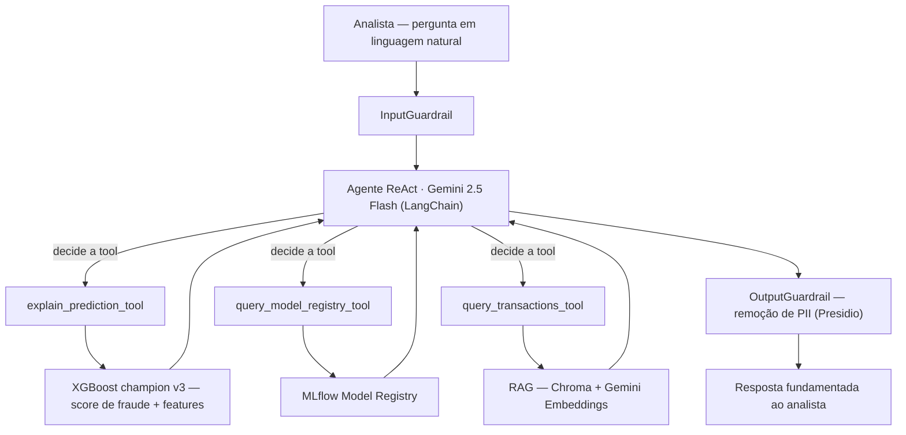

# datathon-fraude

**Plataforma MLOps para Prevenção a Fraude Financeira com Agente LLM**

> Projeto Integrador — Datathon Fase 05 | Turma 6MLET | FIAP/PosTech  
> Autora: Maria L F de Araujo | [mluci3@gmail.com](mailto:mluci3@gmail.com)  
> Repositório: [github.com/Mluci3/datathon-fraude](https://github.com/Mluci3/datathon-fraude)

---

> **TL;DR (English):** An end-to-end MLOps platform for financial fraud detection that pairs an **XGBoost** classifier (champion) / MLP (challenger) — tracked in **MLflow** — with a **ReAct LLM agent** ("ML Copilot", LangChain + Gemini 2.5 Flash) and a **RAG** knowledge base (Chroma). Fraud analysts query and interpret the model's decisions in natural language. Includes **RAGAS + LLM-as-judge** evaluation and governance (OWASP Top 10 LLM, red team, LGPD). Note: trained on **synthetic data** — see the Limitations section.

## Sobre o Projeto

O **datathon-fraude** é uma plataforma MLOps completa para detecção e prevenção de fraudes em transações financeiras. O sistema combina um modelo XGBoost de alta performance com um agente LLM (ML Copilot) que permite a analistas de fraude consultar predições, interpretar decisões do modelo e investigar padrões via linguagem natural.

**Frase de impacto:**
> "Um ML Copilot para cientistas de dados em fraude — integrando pipeline MLOps completo com um agente LLM capaz de interpretar modelos, consultar experimentos e fornecer contexto para decisões."

### Decisões Arquiteturais e Gaps do Enunciado

Este projeto foi desenvolvido individualmente sem o enunciado formal da empresa convidada (30% da avaliação). Todas as decisões tomadas sob incerteza — incluindo escolha de domínio, stack técnica, ferramentas descartadas e motivos — estão documentadas formalmente em:

📄 [`docs/DATATHON_GAPS_E_DECISOES_v3.md`](docs/DATATHON_GAPS_E_DECISOES_v3.md)

---

## Resultados

### Modelo Champion

| Métrica | Valor |
|---|---|
| AUC-ROC | 0.9997 |
| Recall | 1.0000 |
| Precision | 0.9756 |
| F1-Score | 0.9877 |

### Avaliação do Agente (RAGAS — Run 3)

| Métrica | Valor | Status |
|---|---|---|
| Faithfulness | 0.767 | ✅ |
| Answer Relevancy | 0.711 | ✅ |
| Context Precision | 0.818 | ✅ |
| Answer Correctness | 0.651 | ⚠️ |

**Sobre a Answer Correctness (0.651):** é a métrica mais conservadora do RAGAS — compara semanticamente a resposta do agente com o *ground truth* exato do golden set. O resultado foi obtido por **iteração ao longo de 3 runs**:

| Métrica | Run 1 | Run 2 | Run 3 (final) |
|---|---|---|---|
| Faithfulness | 0.26 | 0.71 | **0.77** |
| Answer Relevancy | NaN | 0.59 | **0.71** |
| Answer Correctness | NaN | 0.59 | **0.65** |

A indexação da knowledge base conceitual (Run 1→2) elevou o faithfulness; a correção do embedding (`gemini-embedding-001`), o aumento do timeout do subprocess e `max_iterations` (Run 2→3) resolveram os valores `NaN`. O gap restante vem de **3 das 25 amostras** ignoradas por timeout do subprocess de predição e da estrutura mais rica das respostas do agente frente ao ground truth sintético. **Próximos passos:** subir o timeout do subprocess (60→90s), pré-carregar o modelo em memória e enriquecer o golden set. (Detalhes em [`docs/SYSTEM_CARD.md`](docs/SYSTEM_CARD.md) seções 6.4–6.5.)

### LLM-as-Judge (3 critérios)

| Critério | Nota |
|---|---|
| Precisão Técnica | 7.4/10 |
| Explicabilidade | 9.5/10 |
| Conformidade LGPD | 10.0/10 |
| **Nota Geral** | **8.96/10** |

---

## ⚠️ Limitações e validade dos resultados

> As métricas acima são excelentes porque o modelo foi treinado e avaliado em **dados sintéticos**. Elas **não devem ser lidas como o desempenho esperado em produção real**.

**Por que as métricas são tão altas (AUC 0.9997, Recall 1.0):**
- O dataset é 100% sintético (10.000 transações, ~2% de fraude, `seed=42`, gerado com SDV e versionado via DVC). Como os padrões de fraude são gerados a partir de regras e distribuições conhecidas, as classes ficam muito mais **separáveis** do que em dados reais — por isso AUC ~1.0 e Recall 1.0.
- Em fraude real os padrões são ruidosos, mudam no tempo (*concept drift*) e os fraudadores se adaptam de forma adversarial. Métricas quase perfeitas são esperadas em dados sintéticos separáveis, não em produção.

**O que mudaria com dados reais:**
- Recall e precision cairiam, com um trade-off explícito entre bloquear fraude e barrar cliente legítimo.
- Seria necessária **validação temporal** (treinar no passado, testar no futuro) em vez de split aleatório, além de monitoramento de **drift** (já previsto em `src/monitoring/drift.py`) e **recalibração** periódica.
- Atenção redobrada a **data leakage** (features disponíveis só após a decisão) e a desbalanceamento mais severo.

**Por que o projeto continua válido:** o objetivo aqui é demonstrar a **engenharia de ponta a ponta** (pipeline MLOps, agente ReAct, RAG, avaliação e governança), não bater recorde de métrica. O uso de dados sintéticos é uma decisão consciente e documentada.

Documentação detalhada: [`docs/MODEL_CARD.md`](docs/MODEL_CARD.md) · [`docs/SYSTEM_CARD.md`](docs/SYSTEM_CARD.md) · [`docs/DATATHON_GAPS_E_DECISOES_v3.md`](docs/DATATHON_GAPS_E_DECISOES_v3.md).

---

## Arquitetura

```
┌─────────────────────────────────────────────────────────┐
│                    datathon-fraude                       │
│                                                         │
│  ┌──────────┐    ┌───────────┐    ┌──────────────────┐  │
│  │ Pipeline │    │  MLflow   │    │  Agente ReAct    │  │
│  │ de Dados │───▶│  Registry │◀───│  + 3 Tools       │  │
│  │ (DVC)    │    │           │    │  (LangChain)     │  │
│  └──────────┘    └───────────┘    └────────┬─────────┘  │
│                                            │            │
│  ┌──────────┐    ┌───────────┐    ┌────────▼─────────┐  │
│  │ XGBoost  │    │  FastAPI  │    │  Gemini 2.5 Flash│  │
│  │ Champion │◀───│  Endpoint │    │  (Google AI)     │  │
│  │  v3      │    │           │    └──────────────────┘  │
│  └──────────┘    └───────────┘                          │
│                                                         │
│  ┌──────────────────────────────────────────────────┐   │
│  │  Guardrails: InputGuardrail + OutputGuardrail    │   │
│  │  Observabilidade: Langfuse + Evidently           │   │
│  └──────────────────────────────────────────────────┘   │
└─────────────────────────────────────────────────────────┘
```

### Fluxo do agente (ML Copilot)



Para detalhes completos da arquitetura, consulte [`docs/SYSTEM_CARD.md`](docs/SYSTEM_CARD.md).

---

## Pré-requisitos

- Python 3.11+
- Docker Desktop
- Conta Google AI (Gemini API key)
- Git + DVC

---

## Instalação

```bash
# 1. Clone o repositório
git clone https://github.com/Mluci3/datathon-fraude.git
cd datathon-fraude

# 2. Crie o ambiente virtual
python -m venv .venv
source .venv/bin/activate  # Linux/Mac

# 3. Instale as dependências
pip install -e .

# 4. Configure as variáveis de ambiente
cp .env.example .env
# Edite o .env com suas chaves de API
```

---

## Variáveis de Ambiente

Copie `.env.example` para `.env` e preencha:

```bash
# LLM
GOOGLE_API_KEY=your_google_api_key

# MLflow
MLFLOW_TRACKING_URI=http://localhost:5001

# Chroma
CHROMA_HOST=localhost
CHROMA_PORT=8001

# Langfuse (observabilidade)
LANGFUSE_PUBLIC_KEY=your_langfuse_public_key
LANGFUSE_SECRET_KEY=your_langfuse_secret_key
LANGFUSE_BASE_URL=https://us.cloud.langfuse.com

# RAGAS (avaliação)
OPENAI_API_KEY=your_openai_api_key  # opcional, para avaliação RAGAS
```

---

## Como Subir os Serviços

Execute na ordem abaixo. Cada serviço deve ser iniciado em terminal separado.

### 1. Chroma (Vector Store)

```bash
docker compose up -d
```

Verifica: `curl http://localhost:8001/api/v2/heartbeat`

### 2. MLflow (Experiment Tracking)

```bash
mlflow server \
  --host 127.0.0.1 \
  --port 5001 \
  --backend-store-uri sqlite:///mlruns/mlflow.db \
  --default-artifact-root ./mlartifacts &
```

Verifica: `curl http://localhost:5001/health`  
UI: [http://localhost:5001](http://localhost:5001)

### 3. FastAPI (Serving do Agente)

```bash
PYTHONPATH=src uvicorn src.serving.app:app --port 8000
```

Verifica: `curl http://localhost:8000/health`  
Swagger: [http://localhost:8000/docs](http://localhost:8000/docs)

---

## Como Usar o Agente

### Via Swagger UI

Acesse [http://localhost:8000/docs](http://localhost:8000/docs) e use o endpoint `POST /chat`.

### Via curl

```bash
curl -X POST http://localhost:8000/chat \
  -H "Content-Type: application/json" \
  -d '{"message": "Analise a transação TXN_009930 e me diga se é fraude."}'
```

### Via endpoint de predição direta

```bash
curl -X POST http://localhost:8000/predict \
  -H "Content-Type: application/json" \
  -d '{"transaction_id": "TXN_009930"}'
```

---

## Scripts Principais

### Treino do Modelo

```bash
PYTHONPATH=src python src/models/train.py
```

### Avaliação RAGAS

```bash
# Requer todos os 3 serviços no ar
PYTHONPATH=src python evaluation/ragas_eval.py
```

### LLM-as-Judge

```bash
PYTHONPATH=src python evaluation/llm_judge.py
```

### Drift Detection

```bash
PYTHONPATH=src python src/monitoring/drift.py
```

### EDA

```bash
PYTHONPATH=src python notebooks/run_eda.py
# Relatório: notebooks/eda_report.html
```

### Testes

```bash
PYTHONPATH=src pytest tests/ -v --cov=src
```

---

## Estrutura do Repositório

```
datathon-fraude/
├── .github/workflows/ci.yml     # CI/CD GitHub Actions
├── configs/
│   └── model_config.yaml        # Hiperparâmetros e critérios de promoção
├── data/
│   ├── golden_set/              # 25 pares para avaliação RAGAS
│   ├── knowledge_base/          # Base conceitual do domínio de fraude
│   ├── processed/               # Features processadas (DVC)
│   └── raw/                     # Dados brutos sintéticos (DVC)
├── docs/
│   ├── BENCHMARK.md             # Comparativo 3 configurações de LLM
│   ├── CHANGELOG.md             # Histórico de versões
│   ├── DATATHON_GAPS_E_DECISOES_v3.md  # Decisões arquiteturais formais
│   ├── LGPD_PLAN.md             # Plano de conformidade LGPD
│   ├── MODEL_CARD.md            # Especificação do modelo champion
│   ├── OWASP_MAPPING.md         # Mapeamento OWASP Top 10 LLM
│   ├── RED_TEAM_REPORT.md       # 5 cenários de adversarial testing
│   └── SYSTEM_CARD.md           # Descrição completa do sistema
├── evaluation/
│   ├── ragas_eval.py            # Avaliação RAGAS (4 métricas)
│   ├── llm_judge.py             # LLM-as-Judge (3 critérios)
│   └── drift_results.json       # Resultados de drift detection
├── models/
│   └── champion_v3.joblib       # Modelo champion serializado
├── notebooks/
│   ├── run_eda.py               # Script EDA
│   └── eda_report.html          # Relatório EDA gerado
├── src/
│   ├── agent/
│   │   ├── react_agent.py       # Agente Gemini 2.5 Flash
│   │   ├── tools.py             # 3 tools customizadas
│   │   └── rag_pipeline.py      # Chroma + Gemini Embeddings
│   ├── data/
│   │   └── synthetic_generator.py
│   ├── features/
│   │   └── feature_engineering.py
│   ├── models/
│   │   ├── train.py             # Pipeline de treino XGBoost
│   │   ├── baseline_mlp.py      # MLP PyTorch challenger
│   │   ├── registry.py          # MLflow Model Registry
│   │   └── explainer.py         # SHAP explicabilidade
│   ├── monitoring/
│   │   └── drift.py             # Drift detection Evidently
│   ├── security/
│   │   └── __init__.py          # Guardrails (implementados em app.py)
│   └── serving/
│       ├── app.py               # FastAPI + Guardrails
│       └── Dockerfile
└── tests/
    ├── test_api.py              # Testes de endpoint
    └── test_features.py         # Testes de feature engineering
```

---

## Documentação de Governança

| Documento | Descrição |
|---|---|
| [SYSTEM_CARD](docs/SYSTEM_CARD.md) | Arquitetura, decisões técnicas, limitações |
| [MODEL_CARD](docs/MODEL_CARD.md) | Métricas, features, fairness, rastreabilidade |
| [OWASP_MAPPING](docs/OWASP_MAPPING.md) | 5 ameaças LLM mapeadas com mitigações |
| [RED_TEAM_REPORT](docs/RED_TEAM_REPORT.md) | 5 cenários adversariais testados |
| [LGPD_PLAN](docs/LGPD_PLAN.md) | Conformidade LGPD — 10 princípios do Art. 6º |
| [BENCHMARK](docs/BENCHMARK.md) | Comparativo Ollama → Groq → Gemini |
| [GAPS_E_DECISOES](docs/DATATHON_GAPS_E_DECISOES_v3.md) | Decisões formais sob incerteza |
| [CHANGELOG](docs/CHANGELOG.md) | Histórico completo de versões |

---

## Observabilidade

| Ferramenta | URL | O que monitora |
|---|---|---|
| MLflow | http://localhost:5001 | Experimentos, métricas, Model Registry |
| Langfuse | https://us.cloud.langfuse.com | Traces do agente, tool calls, latência |
| Evidently | `evaluation/drift_report_*.html` | PSI por feature, drift detection |
| Swagger | http://localhost:8000/docs | Endpoints da API |

---

## Notas de Desenvolvimento

- **PYTHONPATH:** sempre necessário `PYTHONPATH=src` para resolver imports internos
- **M1 Mac:** SHAP causa segfault no processo principal — executa via subprocess isolado
- **Gemini API:** modelo `gemini-2.5-flash` é pago por uso — monitorar consumo em [aistudio.google.com](https://aistudio.google.com)
- **Chroma:** reindexar knowledge base se o Docker for reiniciado do zero via `src/agent/rag_pipeline.py`

---

## Licença

Projeto acadêmico — FIAP/PosTech 6MLET | Abril/2026
